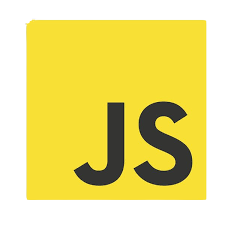
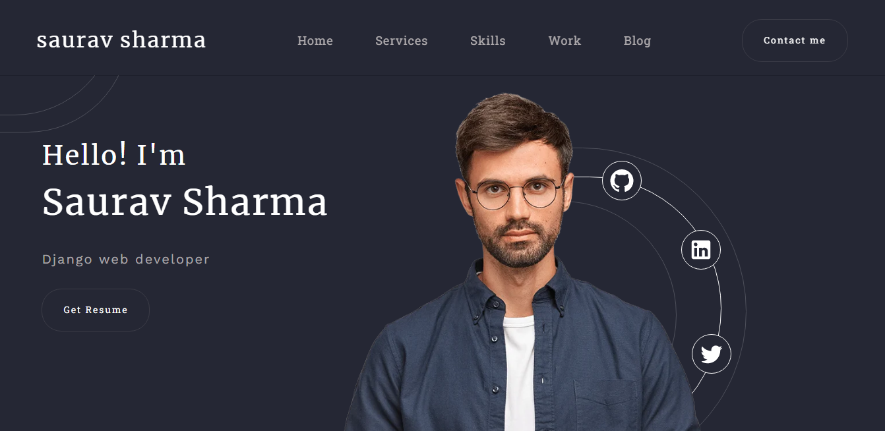
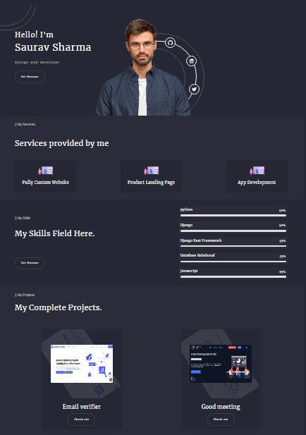

# client-porfolio

## tools and technologies used

### it is a completely responsive portfolio.

## here it's

## Available scripts to start the project

npm i --legacy-peer-deps
`npm i` and `npm start`
